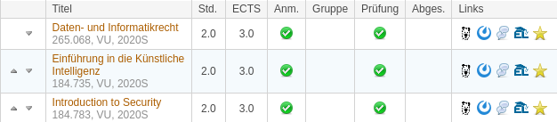
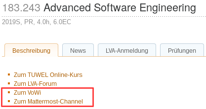

# Userscripts

This repository contains small JavaScripts that enhance TU Wien websites.

To use one of these scripts you need a userscript manager, we recommend [Violentmonkey](https://violentmonkey.github.io/).

## Contributing

Pull requests and issues are welcome!

## Autologin for TISS, TUWEL & OpenCast

[**Install**](https://fsinf.at/userscripts/tuwien-autologin.user.js)

## VoWi & Mattermost links in TISS

[**Install**](https://fsinf.at/userscripts/tiss-enhancement.user.js)
